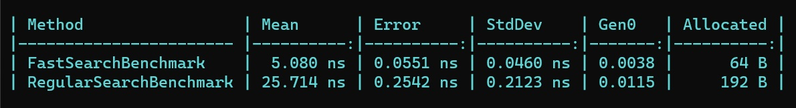
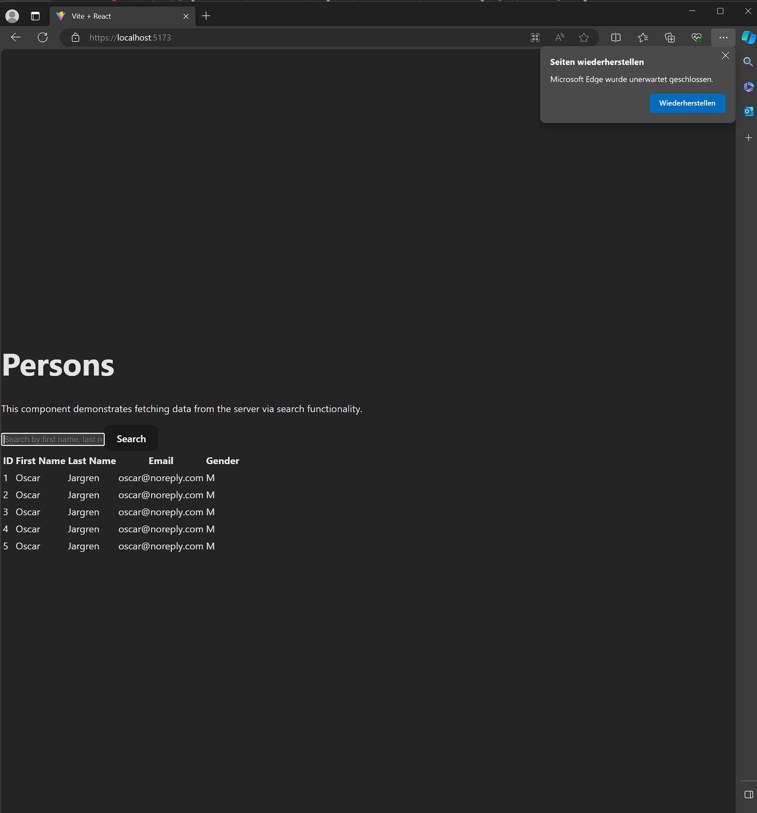
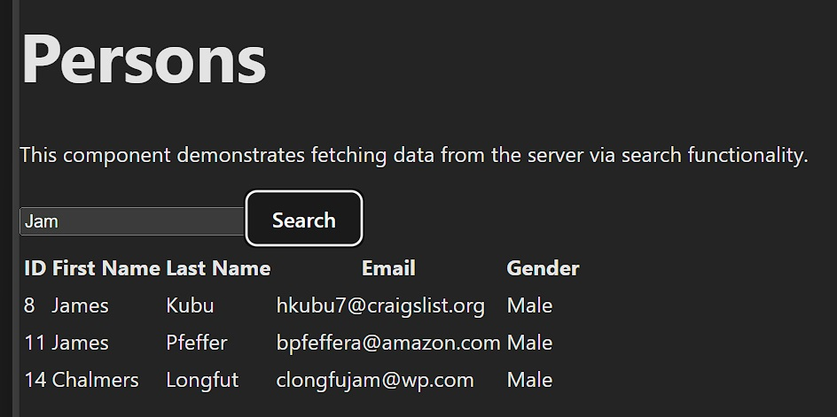
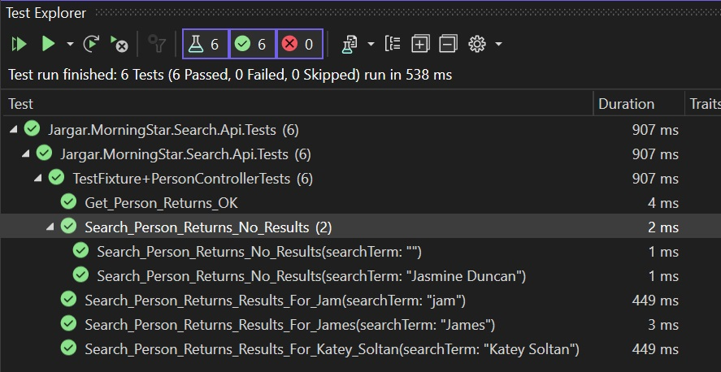

# Jargar.MorningStar.Search
This is a .NET 7 ASP.NET Core and React-based application that allows users to perform a full-text search on a provided dataset and retrieve matching records.
It includes an benchmark project and an a

## Description
The API serves as the data source and search engine for the application. 
It accepts a search parameter and returns records that match the given search criteria from the provided JSON dataset. 
## Table of Contents
- [Prerequisites](#prerequisites)
- [Getting Started](#getting-started)
- [Configuration](#configuration)
- [Contributing](#contributing)
- [License](#license)

## Prerequisites
Before getting started, make sure you have the following prerequisites installed:

.NET 7 SDK
Node.js
React
A code editor or IDE of your choice (e.g., Visual Studio or Visual Studio Code)

# Pictures
Native AOT

Regular Project

